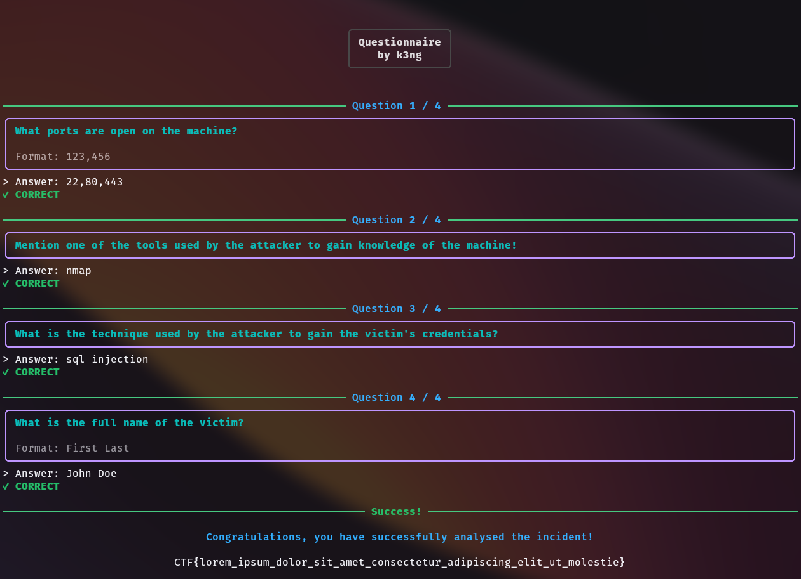

# questionnaire



```bash
docker run -d \
    --name questionnaire \
    -p 1337:1337 \
    -e FLAG="CTF{example_flag}" \
    -v $(pwd)/config.yaml:/app/config.yaml \
    ghcr.io/kawijayaa/questionnaire
```

A configurable questionnaire program designed for CTF challenges that requires users to answer questions to solve the challenge. Supports multi-answer questions, unordered list-based answers, regex matching, and case insensitivity.

**Important**: The application requires a `FLAG` environment variable to be set. The app will refuse to start if it is missing.

## Local Development

```bash
git clone https://github.com/kawijayaa/questionnaire
cd questionnaire

pip install -r requirements.txt

export FLAG="CTF{local_dev_flag}"
python server.py
```

Alternatively, you can create a `.env` file in the root directory:
```bash
FLAG="CTF{local_dev_flag}"
```
